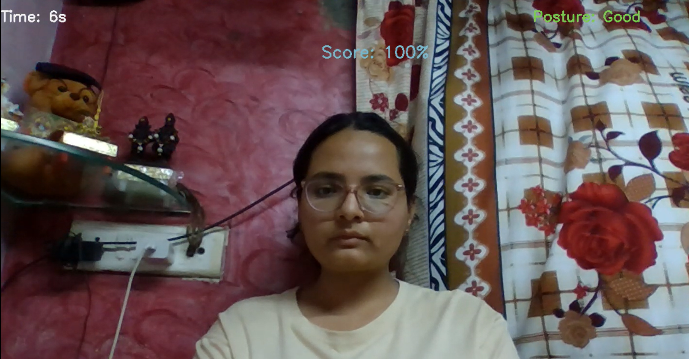
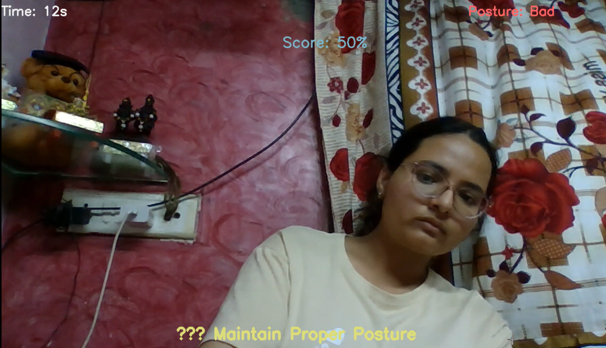
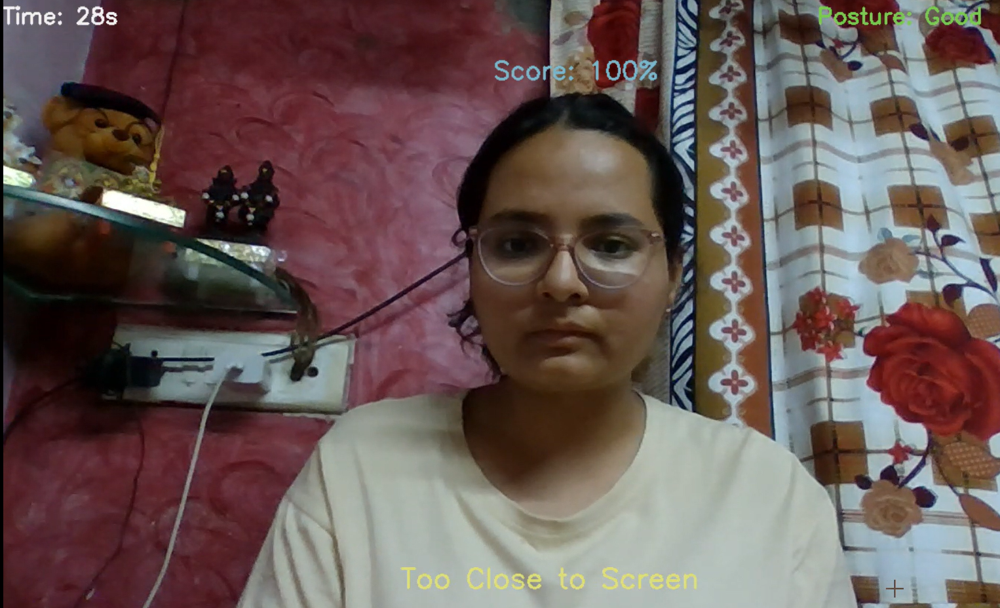
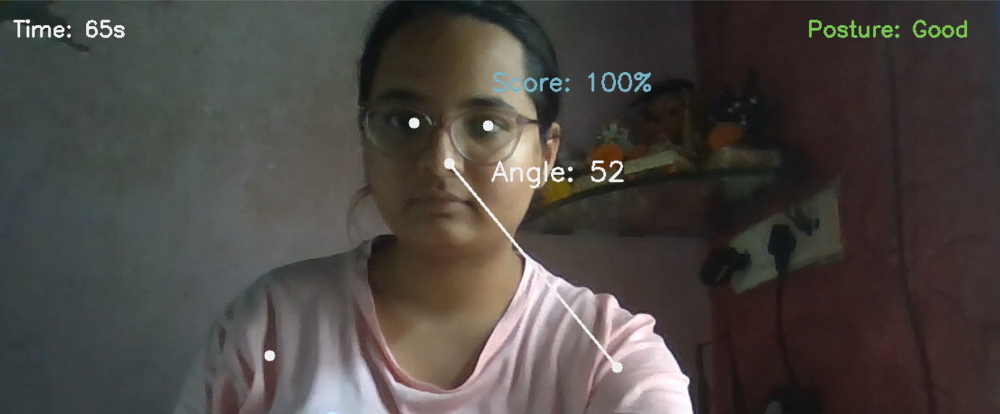
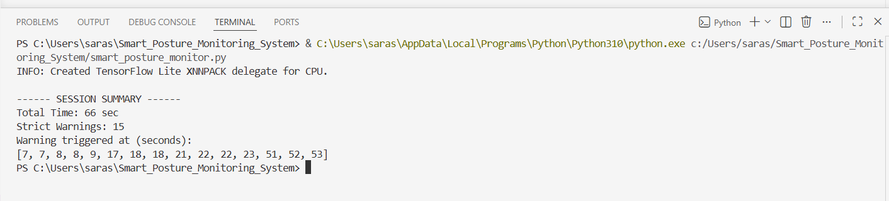

# 🧍 AI Smart Posture Monitoring System

## 📌 Project Overview

The AI Smart Posture Monitoring System is a real-time computer vision application developed using Python, OpenCV, and MediaPipe. It monitors a user's sitting posture through a webcam, detects poor posture and close screen distance, provides live warnings, and includes an Analysis Mode to visualize pose landmarks.

---

## 🎯 Objectives

- Detect poor sitting posture in real time.
- Monitor the user's distance from the screen.
- Alert users when unhealthy posture is detected.
- Encourage healthy posture habits during prolonged computer use.

---

## 🚀 Technologies Used

- Python
- OpenCV
- MediaPipe
- NumPy

---

## 📋 Requirements

- Python **3.10.11**
- Webcam
- VS Code (recommended) or any Python IDE

---

## ✨ Features

- ✅ Real-time posture monitoring
- ✅ Slouching detection
- ✅ Screen distance detection
- ✅ Live posture warnings
- ✅ Posture score calculation
- ✅ Session timer
- ✅ Analysis Mode with pose landmarks and angle visualization
- ✅ Session summary after closing the application

---

## ▶️ Installation

1. Clone this repository.
2. Install the required libraries:

```bash
pip install -r requirements.txt
```

3. Run the application:

```bash
python smart_posture_monitor.py
```

---

## 📂 Project Structure

```
AI-Smart-Posture-Monitoring-System/
│
├── smart_posture_monitor.py
├── requirements.txt
├── LICENSE
├── README.md
└── images/
    ├── home_screen.png
    ├── posture_warning.png
    ├── too_close_warning.png
    ├── analysis_mode.png
    └── session_summary.png
```

---

## 📸 Project Screenshots

### Home Screen



### Posture Warning



### Too Close to Screen



### Analysis Mode



### Session Summary



---

## 🔮 Future Improvements

- Store posture history and statistics.
- Generate posture reports.
- Support multiple user profiles.
- Improve posture classification using deep learning models.
- Develop a desktop application with a graphical user interface (GUI).

---

## 👩‍💻 Author

**Sara Sarode**

B.Tech – Data Science
